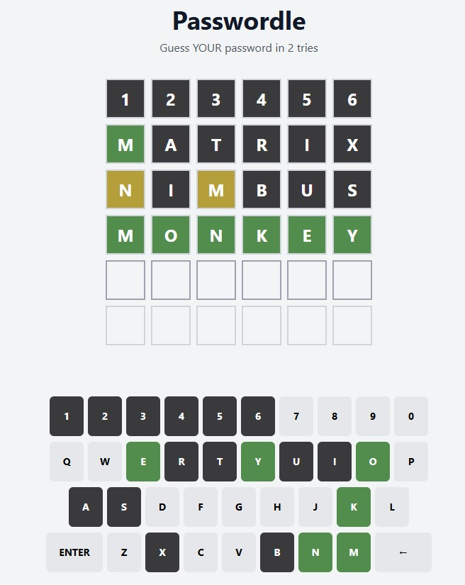
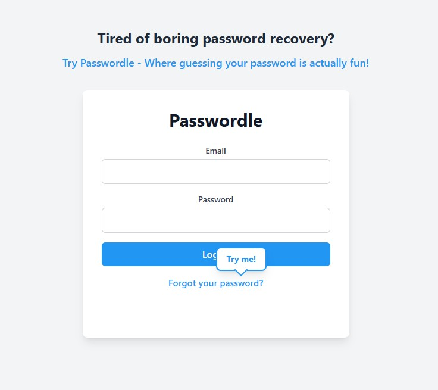

# Passwordle

> **Warning**: This is a joke project. Please don't use this for actual password recovery. Seriously. I mean it. Your security is not a game... except when it is! 😅



## What is Passwordle?

Passwordle is a modern, user-friendly password recovery solution that transforms the traditional "Forgot Password" flow into an engaging interactive experience. Built on the proven Wordle game mechanics, it provides a secure and intuitive way for users to recover their passwords while maintaining high security standards.

Key benefits:

- Reduces user frustration during password recovery
- Implements gamification to improve user engagement
- Provides immediate visual feedback on password attempts
- Supports multiple password recovery strategies
- Maintains security through rate limiting and attempt tracking

## Features

- 🎯 Wordle-style password guessing
- 🎨 Beautiful, modern UI
- 🎭 Funny hints for common passwords
- 🎪 Animated feedback
- 🎲 6 attempts to guess your password
- 🎭 Confetti celebration when you win!



## How to Play

1. Click "Forgot Password" (because that's how all great stories begin)
2. Try to guess your password in 6 attempts
3. Get color-coded feedback:
   - 🟩 Green: Correct letter, correct position
   - 🟨 Yellow: Correct letter, wrong position
   - ⬛ Gray: Letter not in password
4. Use the hilarious hints to help you guess
5. Celebrate with confetti when you win! 🎉

## Technical Stack

- React
- TypeScript
- Tailwind CSS
- Framer Motion
- Vite

## Getting Started

```bash
# Clone the repository
git clone https://github.com/sacul/passwordle.git

# Install dependencies
cd passwordle
npm install

# Start the development server
npm start
```

## Contributing

Contributions are welcome! Feel free to:

- Add more funny password hints
- Improve the UI/UX
- Add more features (like a password strength meter that's actually fun)
- Fix bugs (but only the ones that make the game less fun)

## Security Notice

🚨 **IMPORTANT**: This is a parody project created for entertainment purposes only. It should not be used for actual password recovery or security purposes. The passwords used in this game are common passwords that should never be used in real life.

## License

MIT License - Feel free to use this code for your own projects, but remember: with great power comes great responsibility (and hopefully some laughs).

## Acknowledgments

I created this to test the capabilities of generating projects using AI. Made with [Cursor](https://www.cursor.com/).

---

Made with 🎮 by [sacul](https://github.com/sacul)
